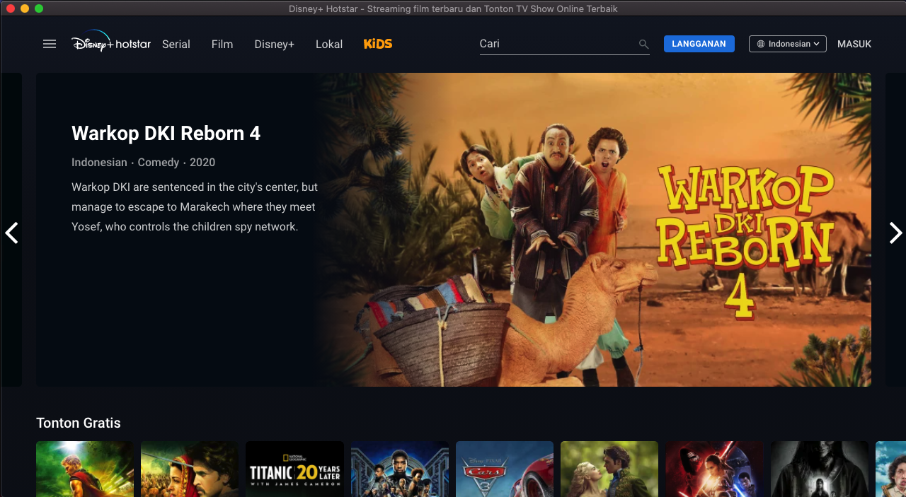

# [Unofficial] Disney+ Hotstar Indonesia Desktop App



## Installation For Your Desktop

Download our latest release and you're off to the races!

| Windows | macOS | GNU/Linux (64-bit only) |
| -- | -- | -- |
| [Download](https://s.id/HotstarWindows) | [Download](https://s.id/HotstarMacOS) | [Download](https://drive.google.com/file/d/18az52g8_eXAB5um2kJTaBnBv14Mw24he/view?usp=sharing) |


## Development Guide

If you want to hack on this project, here is how you do it.
<details><summary>Show instructions</summary>
### Setup

First, clone the project:

```bash
git clone https://github.com/tommy-maulana/Unofficial-Disney-Hotstar-Desktop-App.git

cd Unofficial-Disney-Hotstar-Desktop-App
```

Install dependencies for both the CLI and the Electron app:

```bash
# Under Linux and macOS:
npm run dev-up

# Under Windows:
npm run dev-up-win
```

Then, install Nativefier globally with ```npm install -g nativefier```

and then run this project:

```bash
nativefier --name 'Disney+ Hotstar Indonesia' 'hotstar.com/id'
```
</details>

## License

[MIT](LICENSE.md)
